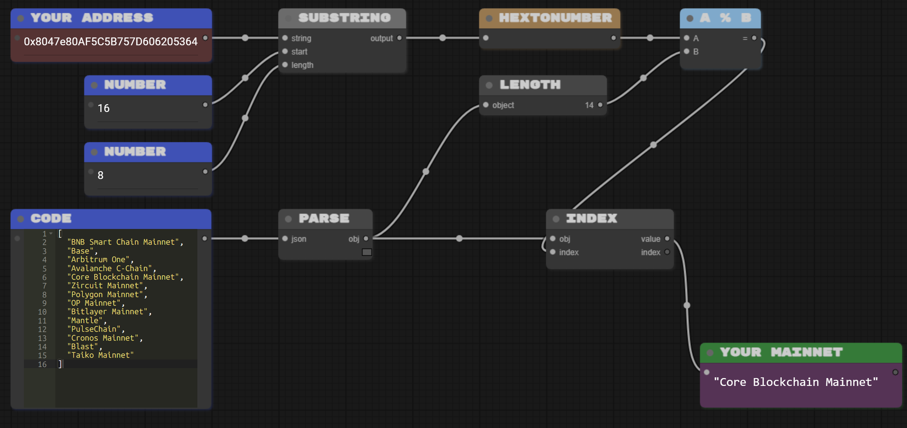
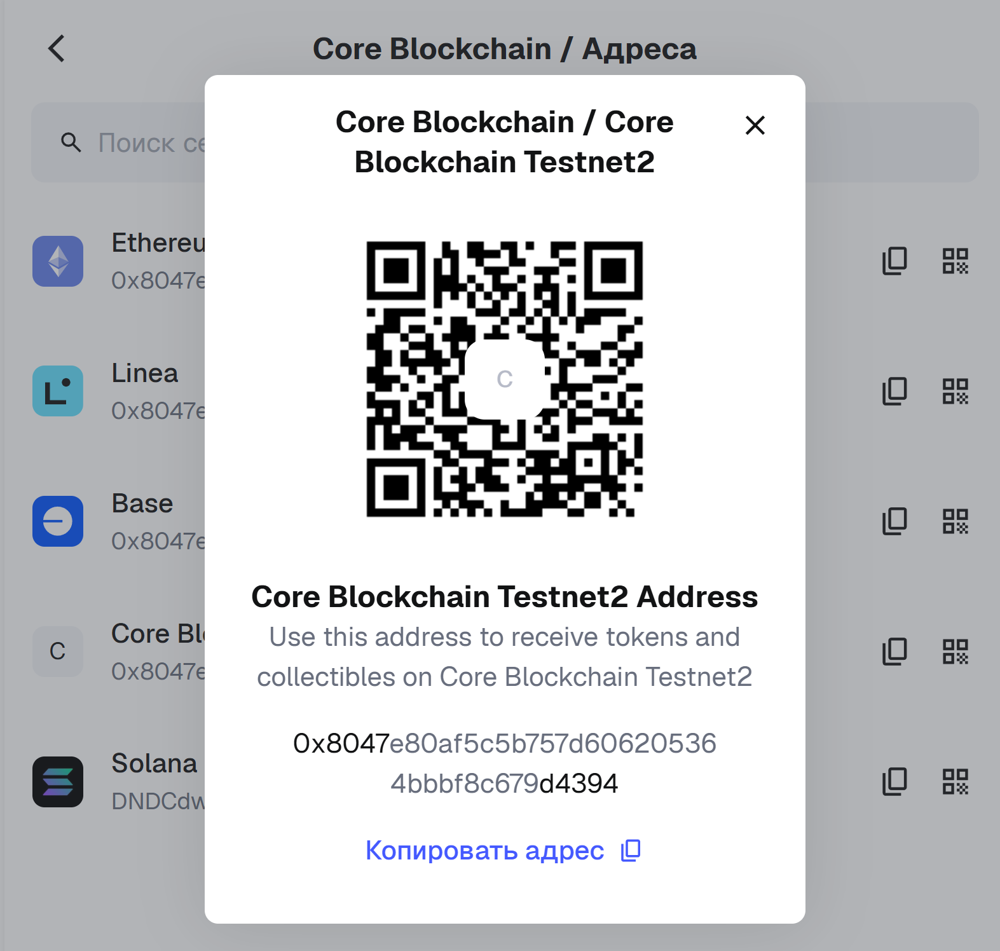
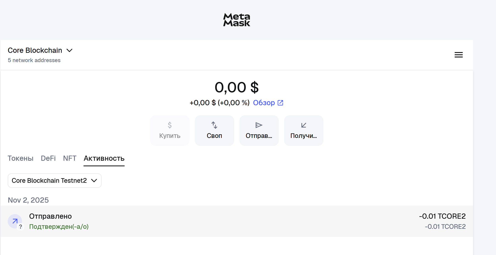
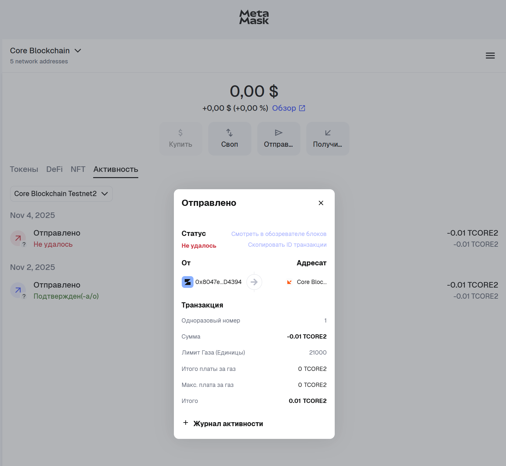
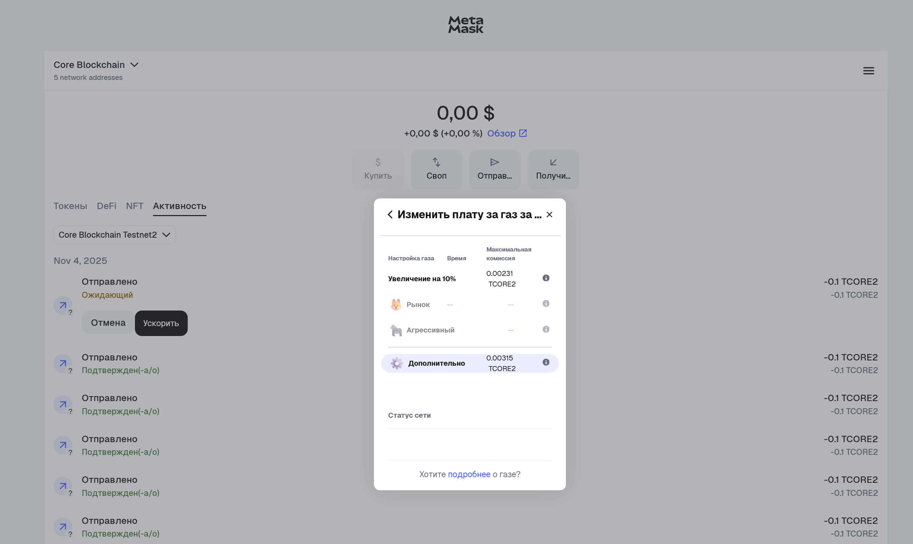
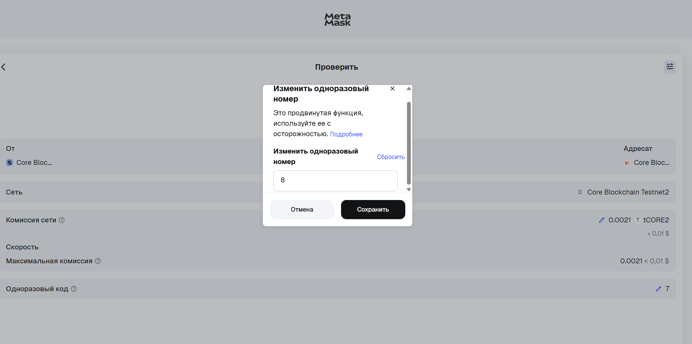
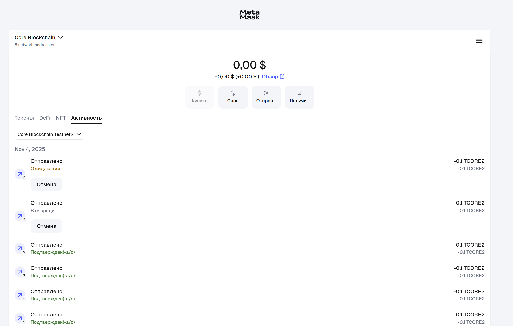
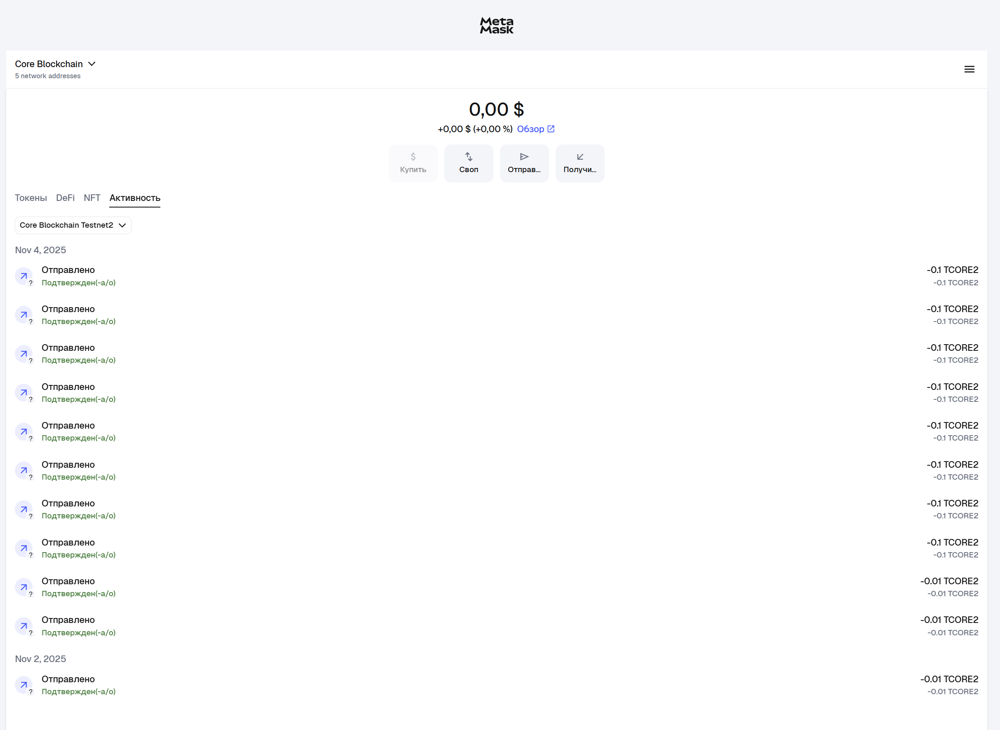

# Assignment 3 – Blockchain & Metamask

## Wallet
**Main Address:**  
`0x8047e80af5c5b757d606205364bbbf8c679d4394` 

**Second Address:**  
`0xe06674d6ef7a81fa16ed3481e7b776e98b928ac5`

---

## Chains
**Explorer Links:**  
- [Core Blockchain Mainnet](https://scan.coredao.org/)  
- [Core Blockchain Testnet2](https://scan.test2.btcs.network/)

**Incoming Transaction:**  
[https://scan.test2.btcs.network/tx/0xb75336a7fe745eb872b15e7125a499c416f553a513c5625fa54cfc512d93aa5b](https://scan.test2.btcs.network/tx/0xb75336a7fe745eb872b15e7125a499c416f553a513c5625fa54cfc512d93aa5b)

---

## Transactions
**Transaction 1:**  
[https://scan.test2.btcs.network/tx/0xb75336a7fe745eb872b15e7125a499c416f553a513c5625fa54cfc512d93aa5b](https://scan.test2.btcs.network/tx/0xb75336a7fe745eb872b15e7125a499c416f553a513c5625fa54cfc512d93aa5b)

**Transaction 2:**  
[https://scan.test2.btcs.network/tx/0x09ce5bf48023c2cc0a5589373ae23f6c2466db5533147fb3a3e5d2794a36304d](https://scan.test2.btcs.network/tx/0x09ce5bf48023c2cc0a5589373ae23f6c2466db5533147fb3a3e5d2794a36304d)

---

## Gas
**Mainnet Gas Tracker:**  
[https://scan.coredao.org](https://scan.coredao.org/)  
Gas price ≈ 60 Gwei  
CORE price ≈ $0.21

**Testnet Gas Tracker:**  
[https://scan.test2.btcs.network](https://scan.test2.btcs.network/)  
Gas price ≈ 100 Gwei  
tCORE2 price ≈ $0.21

**Failed Transaction (0 Gas):**  
[https://scan.test2.btcs.network/tx/0x1bcda59f4bbe47a04db206f15f8c5d52579db56ae3bdabd0aabb197e7f7bd19e](https://scan.test2.btcs.network/tx/0x1bcda59f4bbe47a04db206f15f8c5d52579db56ae3bdabd0aabb197e7f7bd19e)

---

## Nonce
**Transaction with wrong nonce (stuck pending):**  
[https://scan.test2.btcs.network/tx/0x2e754a5c1c0cd751cc3ee681a1b6e8bae5dc1f18f4fa2af76d6da7dd031e6327](https://scan.test2.btcs.network/tx/0x2e754a5c1c0cd751cc3ee681a1b6e8bae5dc1f18f4fa2af76d6da7dd031e6327)

**Next transaction (confirmed after):**  
[https://scan.test2.btcs.network/tx/0x2c479737b53dcd49ce34b705c54bc79b11f168c1dd59b9ce1c56111dd43090ad](https://scan.test2.btcs.network/tx/0x2c479737b53dcd49ce34b705c54bc79b11f168c1dd59b9ce1c56111dd43090ad)

